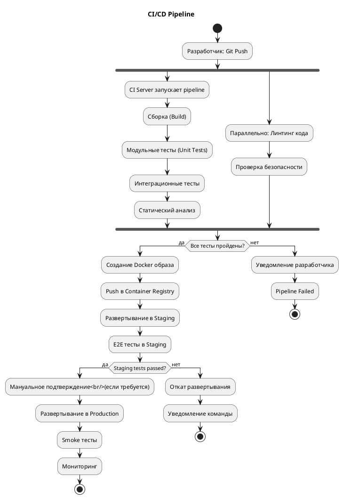

```plantuml
@startuml
title CI/CD Pipeline

start
:Разработчик: Git Push;
fork
    :CI Server запускает pipeline;
    :Сборка (Build);
    :Модульные тесты (Unit Tests);
    :Интеграционные тесты;
    :Статический анализ;
fork again
    :Параллельно: Линтинг кода;
    :Проверка безопасности;
end fork

if (Все тесты пройдены?) then (да)
    :Создание Docker образа;
    :Push в Container Registry;
    :Развертывание в Staging;
    :E2E тесты в Staging;
    
    if (Staging tests passed?) then (да)
        :Мануальное подтверждение<br/>(если требуется);
        :Развертывание в Production;
        :Smoke тесты;
        :Мониторинг;
        stop
    else (нет)
        :Откат развертывания;
        :Уведомление команды;
        stop
    endif
else (нет)
    :Уведомление разработчика;
    :Pipeline Failed;
    stop
endif

@enduml
```