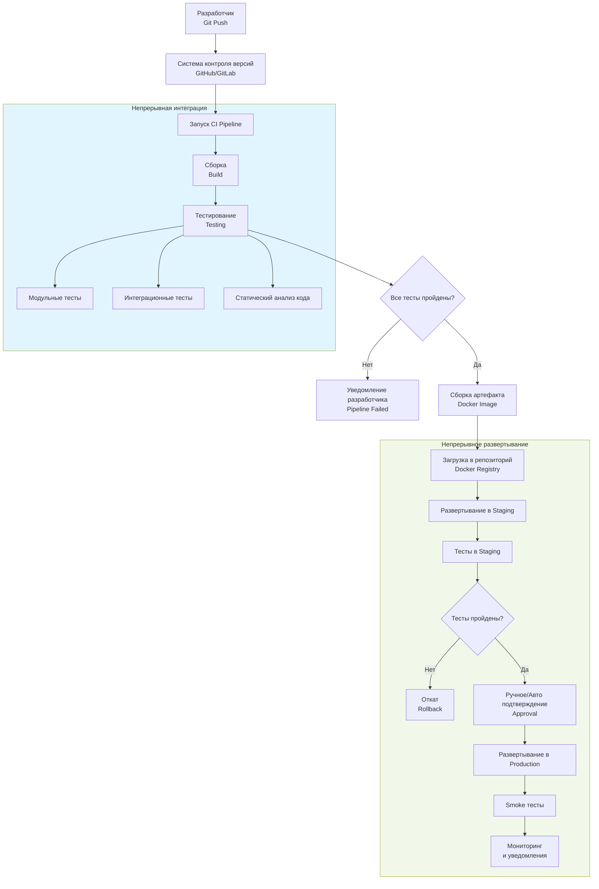

```mermaid
graph TD
    A[Разработчик<br/>Git Push] --> B[Система контроля версий<br/>GitHub/GitLab]
    B --> C[Запуск CI Pipeline]
    
    subgraph CI [Непрерывная интеграция]
        C --> D[Сборка<br/>Build]
        D --> E[Тестирование<br/>Testing]
        E --> E1[Модульные тесты]
        E --> E2[Интеграционные тесты]
        E --> E3[Статический анализ кода]
    end
    
    E --> F{Все тесты пройдены?}
    F -->|Нет| G[Уведомление разработчика<br/>Pipeline Failed]
    F -->|Да| H[Сборка артефакта<br/>Docker Image]
    
    H --> I[Загрузка в репозиторий<br/>Docker Registry]
    
    subgraph CD [Непрерывное развертывание]
        I --> J[Развертывание в Staging]
        J --> K[Тесты в Staging]
        K --> L{Тесты пройдены?}
        L -->|Нет| M[Откат<br/>Rollback]
        L -->|Да| N[Ручное/Авто подтверждение<br/>Approval]
        N --> O[Развертывание в Production]
        O --> P[Smoke тесты]
        P --> Q[Мониторинг<br/>и уведомления]
    end
    
    style CI fill:#e1f5fe
    style CD fill:#f1f8e9
```